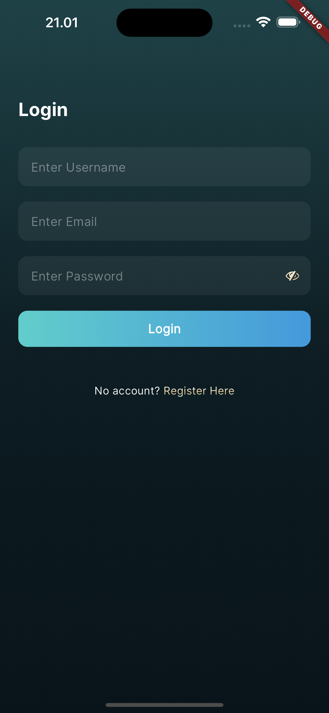
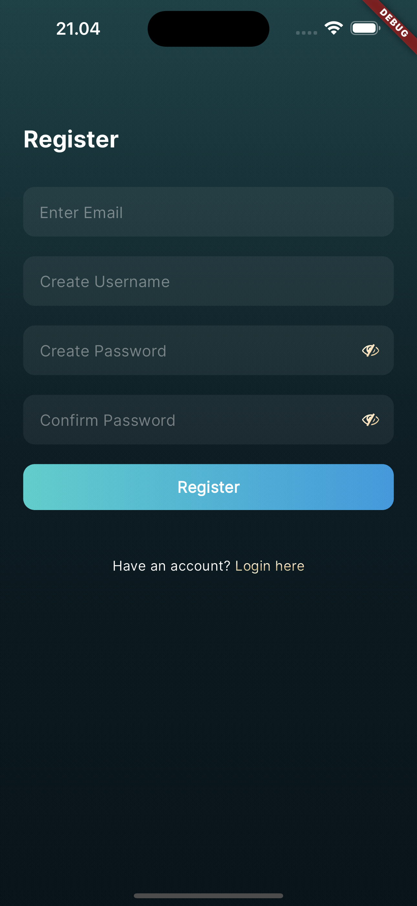
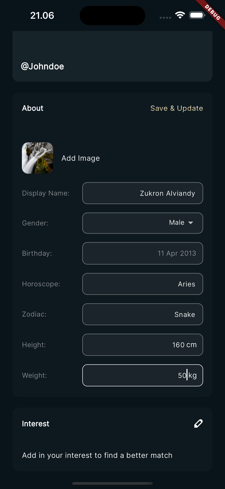
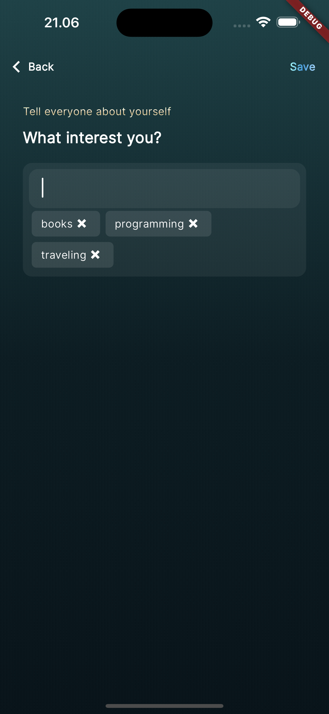

# YouApp Frontend

## Screenshots

    
    
    
    

## Technologies

- Dio
- Bloc
- GoRouter
- Form Builder

## Requirement

- Flutter v3.19

## Features

- Login and Register
- Update profile
- Auto detect Horoscope and Zodiac
- Android and iOS supported

## Setup Local

- Clone this repository
- Run `flutter pub get` to install all dependencies.
- Run application
